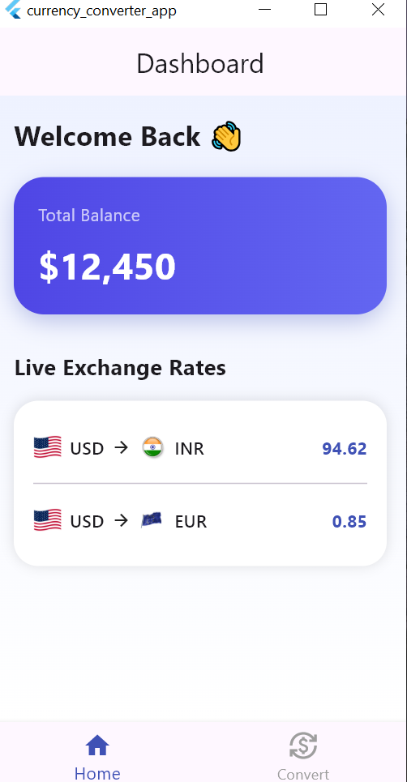
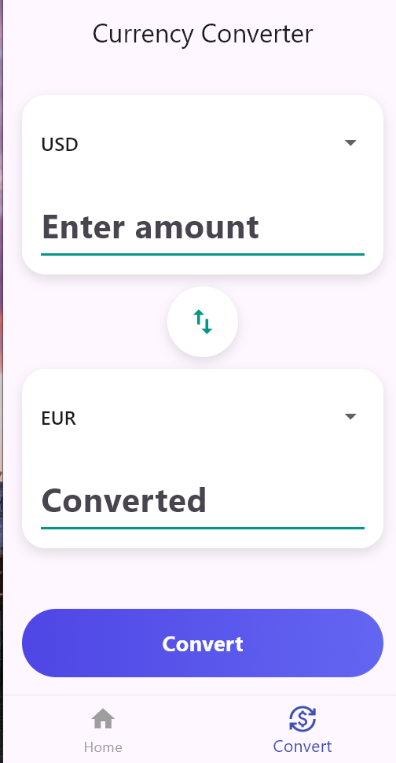

# 💱 Currency Converter App (Flutter)

A modern Flutter app to convert currencies in real-time.

---

## 🚀 Features
- Real-time currency conversion
- Currency swap functionality
- Clean and modern UI
- Provider state management
- Conversion history

---

## 🛠 Tech Stack
- Flutter
- Provider
- REST API

## 🔗 GitHub Repo
https://github.com/swetha-pulluri/currency-converter-flutter

---
## 📱 Screenshots

## 📌 What I Learned
- State management using Provider
- Clean architecture (UI → Provider → Service → API)
- Building scalable apps
